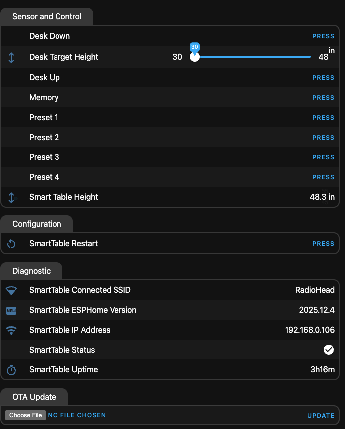

# Using ESP32 WROOM DEV Module

Here is the Pin configuration.

  - id: desk_uart
    rx_pin: GPIO16
    tx_pin: GPIO17
    baud_rate: 9600

  - id: controller_uart
    rx_pin: GPIO12
    tx_pin: GPIO13
    baud_rate: 9600

  